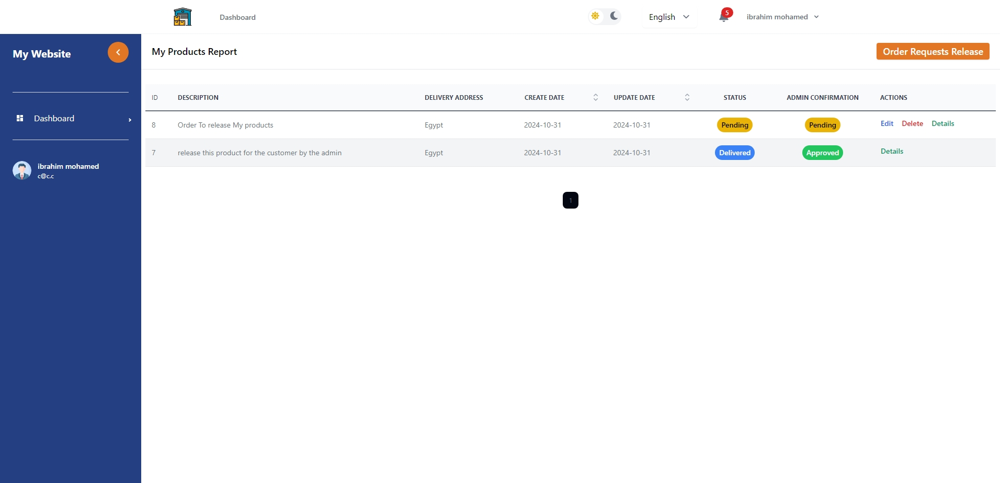

# Laravel Reactjs Inertiajs Inventory Management System (Warehouses)

# Overview
This project provides a robust solution for managing an inventory system, including product management, customer orders, and product releases.with Full Permission System for every movement on the system. It supports both Arabic and English languages ,with dark light mode.

# Features
Products
CRUD operations for managing product , Categoy , Warehouses information .
Add products in both Arabic and English.
Upload product images and descriptions.

# Product Release
Ability to release products based on stock availability.
Manage and track product releases.
Option for customers to request product releases through their account.
Automated notifications for customers when a product is released.

# Customer Accounts
CRUD operations for managing customer accounts.
Customers can view their products, order history, and pending releases.
Customers can request a release of products from their account.
Option for customers to update their information, including billing and shipping details.

 
 
 
# Inventory Reports
Generate comprehensive reports on product stock, sales, and customer orders.
Reports available in both Arabic and English.
Export reports as PDF or Excel files for further analysis.

# Notifications System
Customers and admins receive notifications for stock updates, order statuses, and product releases.

# Administrative Panel
Comprehensive admin panel to manage the entire inventory system.
Access to customer information, product details, stock levels, and order management.
Role-based access control to restrict or allow specific functionalities for different admin users.

# Technologies Used
Backend: Laravel 11  
Frontend: React with Inertia.js  
Database: MySQL  
Languages: Arabic and English Support  
theme: Dark and light mode Support  
Roles: with Full Permission System for every movement on the system   

### Installation

1. Set up your database credentials in the `.env`
2. Run `composer install` to install dependencies
3. Run `npm install` to install dependencies
4. Run `php artisan migrate --seed` to create the database tables
5. Run `npm install` to install the frontend dependencies
6. Run `npm run dev`
7. Run `php artisan serve`
8. Generate a new application key with `php artisan key:generate`

